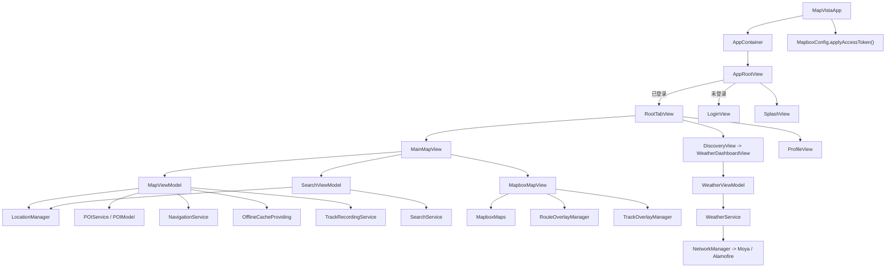
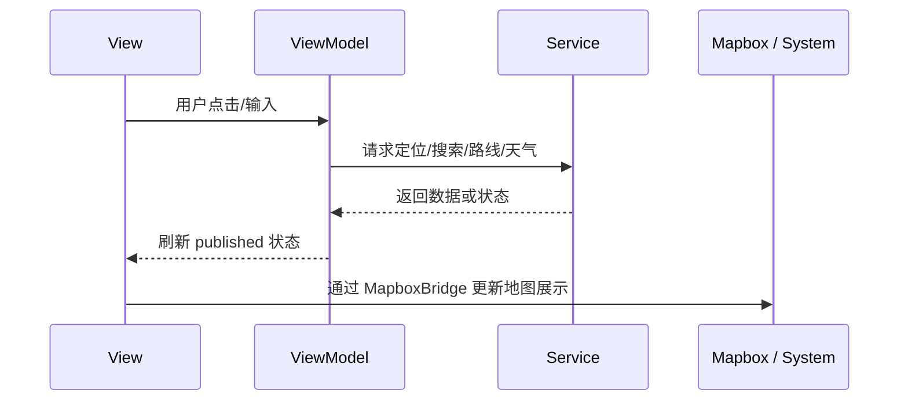

# MapVista-iOS

MapVista 是一个以地图浏览、POI 探索、轨迹记录和天气分析为核心的 iOS 应用。
当前工程采用的是一套偏实战的 `SwiftUI + MVVM + Service + Mapbox Bridge` 架构，重点是把页面、状态、服务和原生地图能力分层隔离，便于继续扩展。

## 架构概览



## 目录分层

```text
MapVista/
  App/           依赖组装、根视图
  Map/           Mapbox 桥接与图层管理
  Models/        领域模型
  Services/      系统能力与数据服务
  Utils/         通用工具与网络封装
  ViewModels/    页面状态与业务编排
  Views/         SwiftUI 页面与组件
```

## 核心层职责

### 1. App 层

App 层负责应用启动、依赖装配和页面入口切换。

- [MapVista/MapVistaApp.swift](MapVista/MapVistaApp.swift) 是 `@main` 入口。
- [MapVista/App/AppContainer.swift](MapVista/App/AppContainer.swift) 负责组装共享服务和 ViewModel。
- [MapVista/App/AppRootView.swift](MapVista/App/AppRootView.swift) 负责登录态判断和 Splash 切换。

### 2. Views 层

Views 层只负责 UI 结构、交互和页面组合，不直接承担业务规则。

- [MapVista/Views/MainMapView.swift](MapVista/Views/MainMapView.swift) 是首页总视图，负责地图、搜索入口、分类筛选、样式面板、底部详情卡片和轨迹录制入口。
- [MapVista/Views/SearchView.swift](MapVista/Views/SearchView.swift) 是搜索页，负责历史记录和搜索结果展示。
- [MapVista/Views/WeatherDashboardView.swift](MapVista/Views/WeatherDashboardView.swift) 是“发现”页的主体。
- [MapVista/Views/ProfileView.swift](MapVista/Views/ProfileView.swift) 是个人中心入口，继续下钻到设置和轨迹列表。

### 3. ViewModels 层

ViewModel 负责把服务层、缓存、定位和 UI 状态拼成页面可消费的数据。

- [MapVista/ViewModels/MapViewModel.swift](MapVista/ViewModels/MapViewModel.swift) 是地图首页的核心状态中枢。
- [MapVista/ViewModels/SearchViewModel.swift](MapVista/ViewModels/SearchViewModel.swift) 负责关键词防抖、本地搜索与在线搜索融合。
- [MapVista/ViewModels/LoginViewModel.swift](MapVista/ViewModels/LoginViewModel.swift) 负责 Apple 登录配置和结果回调。
- [MapVista/ViewModels/WeatherViewModel.swift](MapVista/ViewModels/WeatherViewModel.swift) 负责天气数据请求和钓鱼指数计算。

### 4. Services 层

Services 层封装系统框架、网络、缓存、数据仓库和轨迹能力。

- [MapVista/Services/LocationManager.swift](MapVista/Services/LocationManager.swift) 统一处理定位授权、定位更新和距离计算。
- [MapVista/Services/POIService.swift](MapVista/Services/POIService.swift) 提供 POI 数据源。
- [MapVista/Services/SearchService.swift](MapVista/Services/SearchService.swift) 提供本地检索和评分逻辑。
- [MapVista/Services/NavigationService.swift](MapVista/Services/NavigationService.swift) 负责路线规划和降级策略。
- [MapVista/Services/TrackRecordingService.swift](MapVista/Services/TrackRecordingService.swift) 负责轨迹采样、历史记录和 GPX 导出。
- [MapVista/Services/WeatherService.swift](MapVista/Services/WeatherService.swift) 负责天气接口请求和原始天气模型转换。
- [MapVista/Services/AuthService.swift](MapVista/Services/AuthService.swift) 管理登录态。
- [MapVista/Services/OfflineCacheService.swift](MapVista/Services/OfflineCacheService.swift) 提供缓存接口和内存实现。

### 5. Map 层

Map 层是 SwiftUI 和 Mapbox 原生渲染层之间的桥。

- [MapVista/Map/MapboxMapView.swift](MapVista/Map/MapboxMapView.swift) 通过 `UIViewRepresentable` 包装 `MapView`。
- [MapVista/Map/RouteOverlayManager.swift](MapVista/Map/RouteOverlayManager.swift) 负责路线折线图层。
- [MapVista/Map/TrackOverlayManager.swift](MapVista/Map/TrackOverlayManager.swift) 负责轨迹折线图层。
- [MapVista/Map/MapboxConfig.swift](MapVista/Map/MapboxConfig.swift) 负责 token 和默认镜头参数。

## 运行链路

### 启动流程

1. `MapVistaApp` 启动。
2. `MapboxConfig.applyAccessToken()` 设置 Mapbox token。
3. `AppContainer` 创建共享服务与 ViewModel。
4. `AppRootView` 检查登录态。
5. 根据登录态进入 `LoginView` 或 `RootTabView`。
6. Splash 短暂展示后切到主内容。

### 首页地图流程

1. `MainMapView` 挂载地图和浮层按钮。
2. `MapViewModel` 从 `POIService` 加载 POI，并从 `OfflineCacheProviding` 恢复缓存样式和缓存 POI。
3. `LocationManager` 持续更新当前位置。
4. `MapboxMapView` 根据 `cameraState`、`selectedStyle`、`sceneMode` 和 `routeCoordinates` 刷新地图。
5. 用户点击 POI 后，`MapViewModel` 更新选中态、相机和路线信息。
6. 用户点击“导航到这里”后，`NavigationService` 计算路线，同时尝试打开高德或 Apple Maps。

### 搜索流程

1. `SearchView` 监听输入。
2. `SearchViewModel` 经过 250ms 防抖后触发搜索。
3. 先用 `LocalSearchService` 对本地 POI 做相关性排序。
4. 再用 `MKLocalSearch` 补充远程地理检索结果。
5. 结果回传给地图页，驱动选中 POI 和镜头切换。

### 天气流程

1. `WeatherDashboardView` 创建 `WeatherViewModel`。
2. `WeatherViewModel` 调用 `WeatherService`。
3. `WeatherService` 通过 `NetworkManager` 和 Moya 发请求。
4. 原始天气数据被映射成 `WeatherData`。
5. `WeatherViewModel` 计算 `FishingScoreResult` 给 UI 展示。

## 数据与状态设计

- `POIModel` 是核心领域对象，承载坐标、分类、标签、离线可用性和搜索别名。
- `SearchResult` 是搜索结果包装层，统一承载本地结果和远程结果。
- `WeatherData` 与 `FishingScoreResult` 分别对应原始气象数据和计算后的业务结果。
- `TrackRecord` / `TrackPoint` 负责轨迹历史与导出。
- `MapStyle`、`MapSceneMode`、`MapCameraState` 负责地图样式、场景和镜头状态。

## 状态流向



## 当前工程的特点

- 适合快速迭代地图类产品，页面拆分清晰。
- 业务状态已经从视图中抽离出来，后续继续拆分测试比较顺手。
- 原生地图能力和 SwiftUI 的分工明确，复杂的图层逻辑集中在 Map 层。
- 数据源目前偏本地和 Mock，后续可以平滑替换成真正的后端或数据库。

## 三方依赖

- `MapboxMaps`
- `Moya`
- `Alamofire`

Pod 配置见 [Podfile](Podfile)。

## 资源与配置

- Mapbox token 通过 [MapVista/Info.plist](MapVista/Info.plist) 注入。
- 定位权限、后台定位和高德 scheme 也在 `Info.plist` 中配置。
- 应用显示名为“摸索”。

## 后续可演进方向

1. 把 `OfflineCacheProviding` 从内存实现升级成持久化存储。
2. 把 `SearchService` 和 `POIService` 从 Mock 数据替换成远程 API。
3. 把 `AuthService` 从单例推进到更标准的注入式认证管理。
4. 把地图相关状态进一步拆成更细的 `MapSession` / `RouteSession`。
